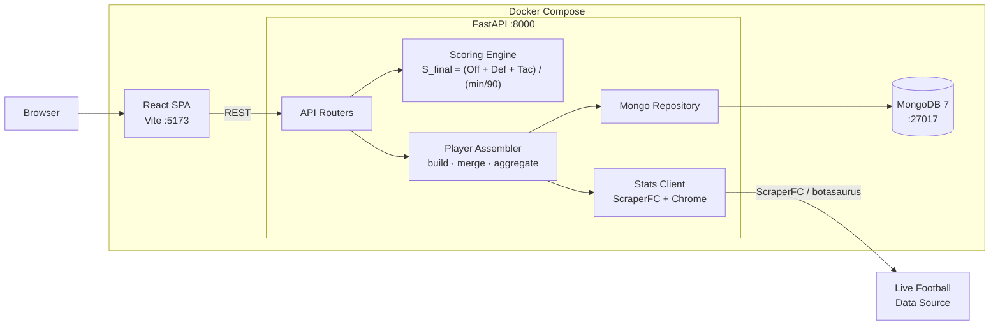

# Football Analytics

A full-stack fantasy football analytics platform that fetches live player statistics, scores them with a position-weighted formula, and surfaces rankings, sleeper picks, and head-to-head comparisons in a data-driven React UI.

---

## Tech Stack

| Layer | Technology |
|---|---|
| Frontend | React 18 · TypeScript · Vite · Tailwind CSS · Recharts |
| Backend | FastAPI · Python 3.12 · PyMongo · Pydantic Settings |
| Database | MongoDB 7 |
| Data Fetching | ScraperFC · botasaurus · Chromium |
| Infrastructure | Docker Compose |
| Testing | pytest · mongomock |

---

## Architecture



**Fetch path:** user triggers a fetch in the Load Data tab → `FantasyMode` → `FetchRunner` pulls stats per competition (concurrent, 24 h cooldown enforced server-side) → `PlayerAssembler` scores via `ScoringEngine` and classifies sleepers → `MongoRepository` upserts to `player_bios` / `player_stats`.

**Read path:** React SPA → API routers → `MongoRepository.get_players()` → paginated and filterable by position, team, nationality, or sleeper flag.

---

## Core Features

- **Fantasy Scoring** — composite score `S_final = (Offensive + Defensive + Tactical) / (minutes / 90)` with position-specific goal/assist weights; GK goals worth 10 pts, FW goals worth 4 pts
- **Rankings** — paginated player table sorted by `S_final`; filterable by position, team, nationality, and sleeper flag
- **Sleeper Detection** — `HIGH_VALUE` flags players where xG+xA significantly exceeds G+A; `OVERPERFORMING` flags the inverse; gated on `minutes > 450`
- **Player Detail** — per-competition stat breakdown and aggregated scores for any player, including those without a linked external ID
- **Head-to-Head Compare** — side-by-side comparison of exactly two players across all stat dimensions
- **Scatter Plot** — interactive xG+xA vs G+A chart (Recharts) across the full dataset
- **Fetch Cooldown** — 24 h rate-limit per league enforced at the API layer; real-time per-competition progress streamed to the UI
- **DB Snapshots** — JSON dump/restore scripts (`backend/scripts/DB/`) for safe local dev iteration

---

## Running the Project

### Prerequisites

- Docker + Docker Compose
- `secrets.env` in the project root:

```env
MONGO_URI=mongodb://mongodb:27017/football_analytics
CORS_ORIGINS=["http://localhost:5173"]
```

### Full stack

```bash
docker compose up
```

| Service | URL |
|---|---|
| Frontend | http://localhost:5173 |
| Backend | http://localhost:8000 |
| API docs | http://localhost:8000/docs |

On first run the database is empty — open the **Load Data** tab and trigger a fetch.

### Local development (without Docker)

```bash
# Backend — from backend/
pip install -r requirements.txt
uvicorn app.main:app --reload

# Frontend — from frontend/
npm install
npm run dev
```

### Tests

```bash
# All tests — from backend/
pytest

# Single file or test
pytest tests/domain/test_scoring_engine.py
pytest tests/domain/test_scoring_engine.py::test_name
```

Tests use `mongomock` — no running MongoDB required.

### DB Snapshots

```bash
# From backend/ with the stack up
python scripts/DB/snapshot_dump.py   # → backend/snapshots/cl-2025-2026.json
python scripts/DB/snapshot_load.py   # restore
```
