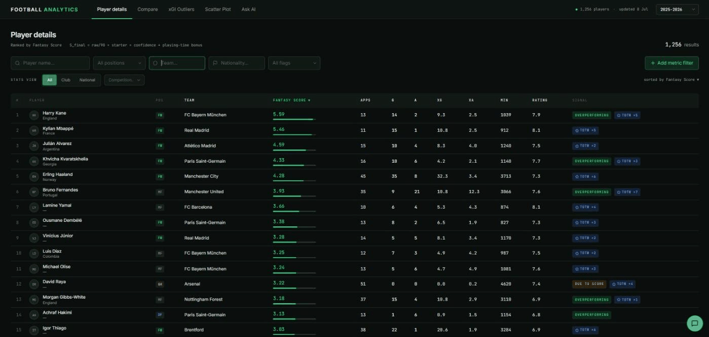
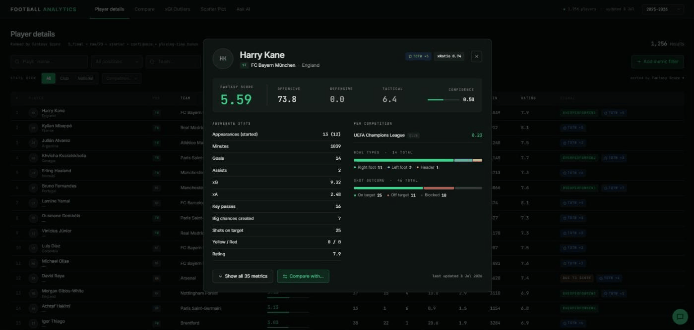
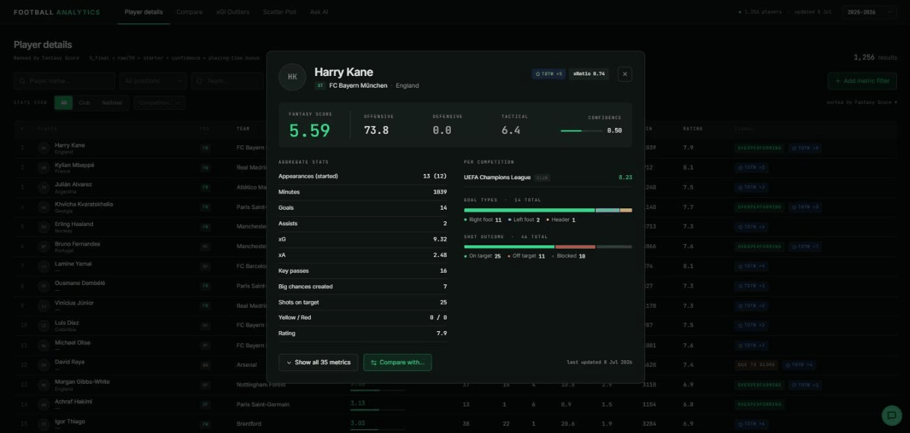
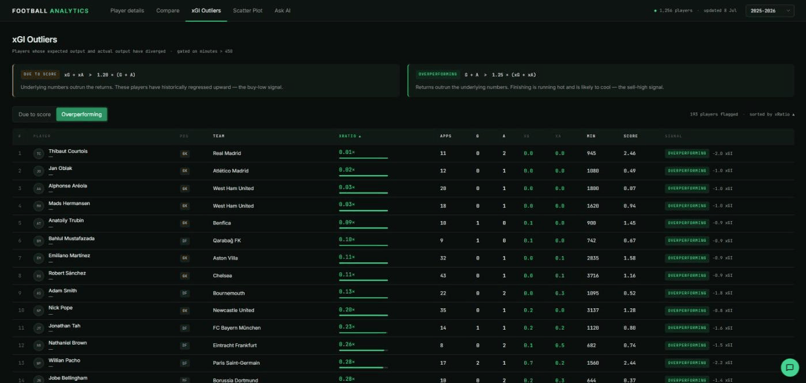
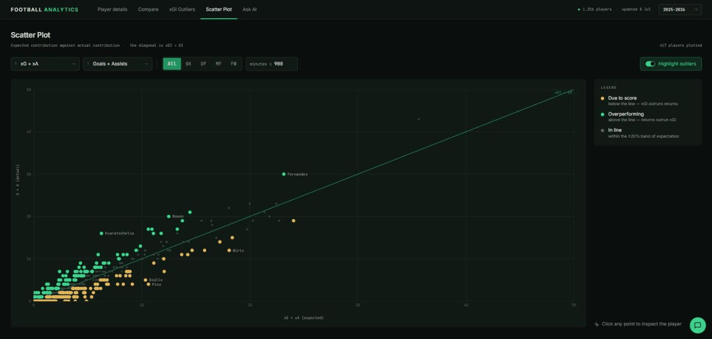
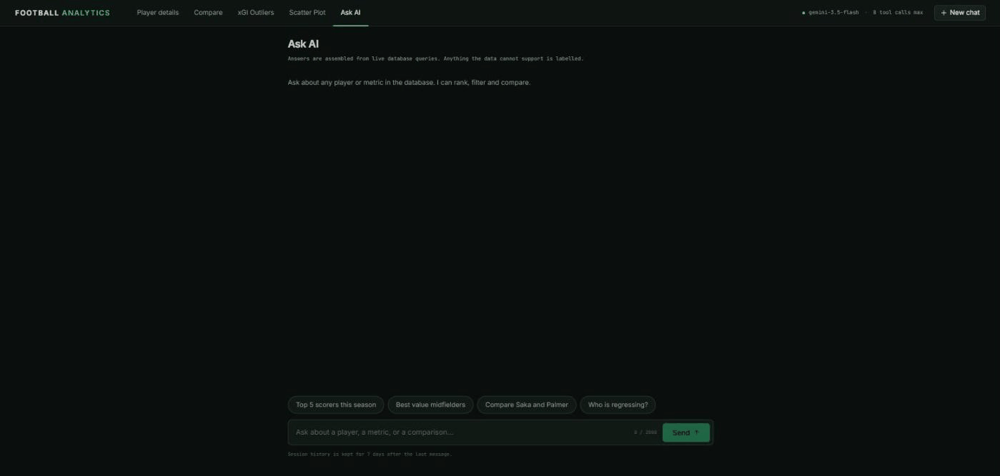
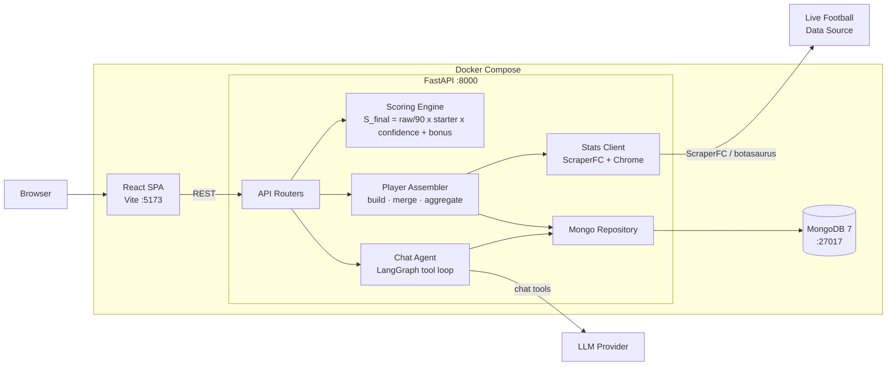

# Football Analytics

A football analytics platform for observing and analyzing player statistics across leagues worldwide, with dedicated support for fantasy league decision-making.

## Screenshots

The GIFs below show the dark-theme UI running against real 2025-26 season data.

**Player Details** — Ranked table with live filters and sorting.



**Player Modal** — Scores, per-competition breakdown, goal and shot bars.



**Compare** — Head-to-head with mirrored bars and a Δ column.



**xGI Outliers** — "Due to score" and "Overperforming" players.



**Scatter Plot** — xG+xA vs G+A with outlier highlighting.



**Ask AI** — Answers built from database tool calls, with a tool trace.



## Disclaimer & Intended Use

This project is a **free, open-source, educational tool** built for football enthusiasts exploring soccer data and fantasy players seeking personal analytical insights.

* **No Affiliation:** This project is not affiliated with, endorsed by, or sponsored by any football league, club, fantasy sports platform, or data provider. All trademarks, data, and intellectual property belong to their respective owners.
* **Third-Party Data:** The software may retrieve data from third-party sources. The authors do not own, control, or warrant this data. 
* **User Responsibility:** You are solely responsible for ensuring that your use of this software—including accessing or fetching third-party platforms—complies with applicable laws, regulations, and the respective third-party Terms of Service.

*The software is provided **"as is"**, without warranty of any kind. The authors accept no liability for its use or for the accuracy of any generated insights. See the [LICENSE](LICENSE) file for full terms.*

---

## Tech Stack

| Layer | Technology |
|---|---|
| Frontend | React 18 · TypeScript · Vite · Tailwind CSS · Recharts · react-markdown · lucide-react icons · Inter/JetBrains Mono fonts |
| Backend | FastAPI · Python 3.12 · PyMongo · Pydantic Settings |
| Chatbot Agent | LangChain · LangGraph (`create_agent`), configurable LLM provider (Gemini free tier by default) |
| Database | MongoDB 7 |
| Data Fetching | ScraperFC · botasaurus · Chromium |
| Infrastructure | Docker Compose |
| Testing | pytest · mongomock |

---

## Architecture


```mermaid
flowchart LR
    User["Browser"]

    subgraph Docker["Docker Compose"]
        FE["React SPA\nVite :5173"]
        subgraph Backend["FastAPI :8000"]
            API["API Routers"]
            SE["Scoring Engine\nS_final = raw/90 x starter x confidence + bonus"]
            PA["Player Assembler\nbuild · merge · aggregate"]
            SC["Stats Client\nScraperFC + Chrome"]
            MR["Mongo Repository"]
            CA["Chat Agent\nLangGraph tool loop"]
        end
        DB[("MongoDB 7\n:27017")]
    end

    EXT["Live Football\nData Source"]
    LLM["LLM Provider"]

    User --> FE
    FE -- REST --> API
    API --> SE
    API --> PA
    API --> CA
    PA --> SC
    PA --> MR
    CA --> MR
    CA -- "chat tools" --> LLM
    MR --> DB
    SC -- "ScraperFC / botasaurus" --> EXT
```

**Fetch path:** developer runs `tools/fetch_cli` → `POST /v1/fetch/` → `FantasyMode` → `FetchRunner` pulls stats per competition (concurrent, no fetch rate limit) → `PlayerAssembler` scores via `ScoringEngine` and classifies sleepers → `MongoRepository` upserts to `player_bios` / `player_stats`.

**Read path:** React SPA → API routers → `MongoRepository.get_players()` → paginated and filterable by name, team, position, nationality, or sleeper flag; name and team are case- and accent-insensitive substring matches, combined with AND when both are set. Sorting also accepts `sort_by=xratio` (the sleeper ratio), which is sort-only — it is not a filter metric and not an agent tool metric.

**Chat path:** floating chat widget (or `?chat=1` full-screen view) → `POST /v1/chat` → `ChatAgent` (LangGraph `create_agent` loop over per-metric-family DB query tools) → answer built from the rows those tools returned. The response also carries `tool_calls` (tool name + row count only, never arguments or row contents) and `uncited` (figures in the answer with no backing row), which the UI renders as a trace and a warning. Session history is a MongoDB checkpoint per thread, expiring 7 days after the last message.

**Meta path:** `GET /v1/meta?season=` → player count, last fetch time, stored seasons, and the active chat model/tool-call cap. Powers the app header's dataset status, season selector, and the Ask AI tab's model line.

---

## Core Features

- **Fantasy Scoring** — composite score `S_final = raw_per90 x starter_bonus x confidence + playing_time_bonus`, where `raw_per90` is `(Offensive + Defensive + Tactical) / (minutes / 90)` with position-specific goal/assist weights (GK goals worth 10 pts, FW goals worth 4 pts). `starter_bonus` rewards regular starters and `confidence` discounts small appearance counts — see `Mathematical_Specification.md`
- **Player Details** — paginated player table sorted by Fantasy Score (`S_final`) by default; live-filterable (250ms debounce) by name, team, position, nationality, and sleeper flag, plus a removable-chip "Add metric filter" popover for any allowlisted metric; click a row for the per-competition stat breakdown and aggregated scores, including players without a linked external ID
- **Defensive Metrics** — tackles, interceptions, clearances, blocks, aerial duels, ball recoveries, and errors leading to a shot/goal are tracked per player and sortable/filterable in Player Details; not yet part of `S_final` scoring
- **Sleeper Detection** — `HIGH_VALUE` flags players where xG+xA significantly exceeds G+A; `OVERPERFORMING` flags the inverse; gated on `minutes > 450`. The xGI Outliers page sorts each tab by the xG+xA/G+A ratio (descending for "Due to score", ascending for "Overperforming")
- **Head-to-Head Compare** — side-by-side comparison of exactly two players across all stat dimensions, with mirrored bars and a per-row delta
- **Scatter Plot** — interactive xG+xA vs G+A chart (Recharts) with selectable X/Y metrics, a position filter, a minimum-minutes filter, an outlier-highlight toggle, and a detail panel for the selected point
- **Dataset Status** — the app header shows player count, last fetch time, and a season selector, backed by `GET /v1/meta`; the Ask AI tab shows the active chat model and its tool-call cap instead
- **Chat Agent** — "Ask AI" navbar tab plus a floating widget on the other tabs (also a full-screen view at `?chat=1`) answers natural-language questions about players and metrics from live DB tool calls; each answer shows which tools ran and how many rows they returned, figures with no supporting row are flagged with a warning, and questions the database cannot answer are answered from the model's own knowledge and labelled as such
- **Developer Data Loading** — `tools/fetch_cli`, a standalone CLI for browsing available competitions/seasons and loading data into MongoDB, with live per-task fetch progress
- **DB Snapshots** — JSON dump/restore scripts (`backend/scripts/DB/`) for safe local dev iteration

---

## Data Schema

Player data is split across two MongoDB collections:

**`player_bios`** — one doc per player (identity, stable across seasons):
```json
{
  "_id": "ObjectId(...)",
  "sofascore_player_id": "277174",
  "name": "Harry Kane",
  "norm_name": "harry kane",
  "position": "FW",
  "position_exact": "ST",
  "nationality": "England",
  "photo_url": "https://photo-url"
}
```

**`player_stats`** — one doc per (player, season):
```json
{
  "_id": "ObjectId(...)",
  "player_bio_id": "ObjectId(...)",
  "season": "2025-2026",
  "team": "Bayern Munich",
  "competitions": [
    {
      "competition": "Germany Bundesliga",
      "competition_type": "club",
      "total_matches": 34,
      "stats": { "goals": 28, "assists": 8, "minutes": 2880, "xg": 24.1, ... },
      "scores": { "offensive": 88.2, "defensive": 2.5, "tactical": 4.1, "s_final": 4.63 },
      "raw_stats": { "totwAppearances": 9 }
    }
  ],
  "aggregated_stats": { "goals": 28, "assists": 8, "minutes": 2880, "xg": 24.1 },
  "aggregated_scores": {
    "offensive": 88.2, "defensive": 2.5, "tactical": 4.1, "s_final": 4.63,
    "underpredicted_flag": null, "underpredicted_ratio": 1.16
  },
  "low_sample_size": false,
  "last_updated": "2026-06-22T10:00:00+00:00"
}
```

`competition_type` is `"club"` for domestic leagues and cups, `"national"` for international tournaments (World Cup, European Championship, etc.). The stats-view filter on the Player Details page uses this field to let you see club-only or national-team-only aggregated scores.

## Running the Project

### Prerequisites

- Docker + Docker Compose
- `secrets.env` in the project root:

```env
MONGO_URI=mongodb://mongodb:27017/football_analytics
CORS_ORIGINS=["http://localhost:5173"]
GEMINI_API_KEY=your-key-here
```

`GEMINI_API_KEY` powers the chat agent (default provider, free tier). Without it the rest of the API still starts — the agent is just disabled and `/v1/chat` returns a degraded response. See [Chat Agent Configuration](#chat-agent-configuration) below for other providers.

### Full stack

```bash
docker compose up
```

After pulling changes to the backend or frontend dependencies, rebuild:

```bash
docker compose build backend
docker compose up -d --force-recreate --renew-anon-volumes frontend  # node_modules lives in an anonymous volume
```

| Service | URL |
|---|---|
| Frontend | http://localhost:5173 |
| Backend | http://localhost:8000 |
| API docs | http://localhost:8000/docs |

On first run the database is empty — use `tools/fetch_cli` (see its README) to load data, developer-driven.

### Local development (without Docker)

```bash
# Backend — from backend/
pip install -r requirements.txt
uvicorn app.main:app --reload

# Frontend — from frontend/
npm install
npm run dev
```

### Tests

```bash
# All tests — from backend/
pytest

# Single file or test
pytest tests/domain/test_scoring_engine.py
pytest tests/domain/test_scoring_engine.py::test_name
```

Tests use `mongomock` — no running MongoDB required. Agent tests live in `backend/tests/agent/`; the offline eval under `backend/tests/agent/eval/` is skipped by default and needs `AGENT_EVAL=1`, a live model, and a populated DB:

```bash
AGENT_EVAL=1 pytest tests/agent/eval -v -s
```

### Chat Agent Configuration

Set in `secrets.env` / `.env`:

| Variable | Default | Notes |
|---|---|---|
| `LLM_PROVIDER` | `gemini` | `gemini`, `openai`, or `anthropic` |
| `LLM_MODEL` | provider default | `openai`/`anthropic` have no default — must be set explicitly |
| `LLM_API_KEY` | unset | falls back to the provider SDK's own env var (e.g. `GEMINI_API_KEY`) |
| `LLM_FALLBACK_MODEL` | unset | model to retry with on failure; empty means no fallback |
| `AGENT_MAX_TOOL_ITERATIONS` | `8` | tool-call loop limit per turn |
| `AGENT_MAX_ROWS` | `25` | max rows a DB query tool can return |
| `CHECKPOINT_COLLECTION` | `chat_checkpoints` | MongoDB collection for session state |
| `CHAT_SESSION_TTL_SECONDS` | `604800` (7 days) | session expiry after the last message |

`openai` and `anthropic` require installing their LangChain package (`langchain-openai` / `langchain-anthropic`) and setting `LLM_MODEL` explicitly.

### Loading Data

The app has no fetch-triggering UI — data loading is developer-driven via
`tools/fetch_cli`, a standalone CLI (its own lightweight venv, separate from
`backend/`) that talks to the running backend over HTTP:

```bash
cd tools
python -m venv .venv
.venv/Scripts/pip install -r requirements.txt

.venv/Scripts/python -m fetch_cli.cli refresh   # pull the competition/season catalog
.venv/Scripts/python -m fetch_cli.cli browse    # see what's available
.venv/Scripts/python -m fetch_cli.cli fetch     # pick a league + season, load it into MongoDB
```

See `tools/fetch_cli/README.md` for full details.

### DB Snapshots

```bash
# From backend/ with the stack up
python scripts/DB/snapshot_dump.py   # → backend/scripts/snapshots/cl-2025-2026.json
python scripts/DB/snapshot_load.py   # restore
```

Claude Code users: the `db-snapshot` skill (`.claude/skills/db-snapshot/SKILL.md`) wraps these scripts for on-demand snapshots.
