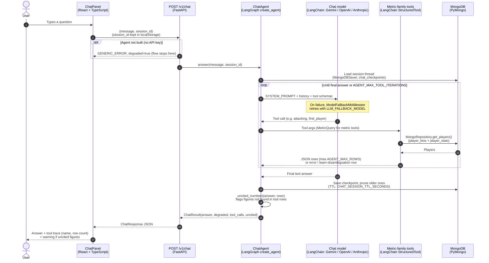

# Chat Agent

The chat agent answers natural-language questions about players and metrics using a LangGraph `create_agent` tool-calling loop over per-metric-family database query tools (`backend/app/agent/tools/`). The LLM provider is configurable (`app/agent/providers.py`); Gemini's free tier is the default. A missing API key disables only the agent — the rest of the API still starts, and `/v1/chat` returns a degraded response instead of failing.

## Request flow

## Configuration

Set in `secrets.env` / `.env`:

| Variable | Default | Notes |
|---|---|---|
| `LLM_PROVIDER` | `gemini` | `gemini`, `openai`, or `anthropic` |
| `LLM_MODEL` | provider default | `openai`/`anthropic` have no default — must be set explicitly |
| `LLM_API_KEY` | unset | falls back to the provider SDK's own env var (e.g. `GEMINI_API_KEY`) |
| `LLM_FALLBACK_MODEL` | unset | model to retry with on failure; empty means no fallback |
| `AGENT_MAX_TOOL_ITERATIONS` | `8` | tool-call loop limit per turn |
| `AGENT_MAX_ROWS` | `25` | max rows a DB query tool can return |
| `CHECKPOINT_COLLECTION` | `chat_checkpoints` | MongoDB collection for session state |
| `CHAT_SESSION_TTL_SECONDS` | `604800` (7 days) | session expiry after the last message |

`openai` and `anthropic` require installing their LangChain package (`langchain-openai` / `langchain-anthropic`) and setting `LLM_MODEL` explicitly.
