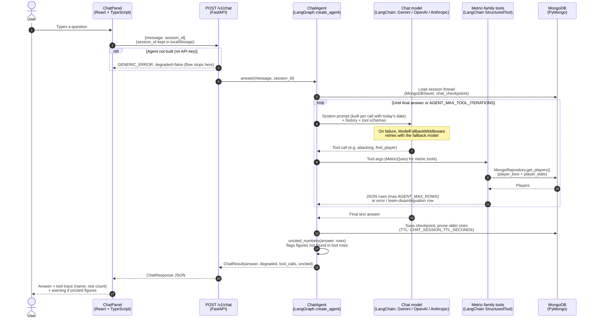

# Chat Agent

The chat agent answers natural-language questions about players and metrics using a LangGraph `create_agent` tool-calling loop over per-metric-family database query tools (`backend/app/agent/tools/`). The LLM provider is configurable (`app/agent/providers.py`); Gemini's free tier is the default. A missing API key disables only the agent — the rest of the API still starts, and `/v1/chat` returns a generic error message instead of failing.

## Request flow

```mermaid
sequenceDiagram
    autonumber
    actor User
    participant UI as ChatPanel<br/>(React + TypeScript)
    participant API as POST /v1/chat<br/>(FastAPI)
    participant Agent as ChatAgent<br/>(LangGraph create_agent)
    participant LLM as Chat model<br/>(LangChain: Gemini / OpenAI / Anthropic)
    participant Tools as Metric-family tools<br/>(LangChain StructuredTool)
    participant DB as MongoDB<br/>(PyMongo)

    User->>UI: Types a question
    UI->>API: {message, session_id}<br/>(session_id kept in localStorage)
    opt Agent not built (no API key)
        API-->>UI: GENERIC_ERROR, degraded=false (flow stops here)
    end
    API->>Agent: answer(message, session_id)
    Agent->>DB: Load session thread<br/>(MongoDBSaver, chat_checkpoints)
    loop Until final answer or AGENT_MAX_TOOL_ITERATIONS
        Agent->>LLM: System prompt (built per call with today's date)<br/>+ history + tool schemas
        Note over LLM: On failure, ModelFallbackMiddleware<br/>retries with the fallback model
        LLM-->>Agent: Tool call (e.g. attacking, find_player)
        Agent->>Tools: Tool args (MetricQuery for metric tools)
        Tools->>DB: MongoRepository.get_players()<br/>(player_bios + player_stats)
        DB-->>Tools: Players
        Tools-->>Agent: JSON rows (max AGENT_MAX_ROWS)<br/>or error / team-disambiguation row
    end
    LLM-->>Agent: Final text answer
    Agent->>DB: Save checkpoint, prune older ones<br/>(TTL: CHAT_SESSION_TTL_SECONDS)
    Agent->>Agent: uncited_numbers(answer, rows)<br/>flags figures not found in tool rows
    Agent-->>API: ChatResult(answer, degraded, tool_calls, uncited)
    API-->>UI: ChatResponse JSON
    UI-->>User: Answer + tool trace (name, row count)<br/>+ warning if uncited figures
```

## Seasons and competitions

- The system prompt is rebuilt on every model call (`dynamic_prompt` middleware) with today's date. "This season" and "last season" follow the calendar (`season.py`; a new season starts in July). The tools read only `settings.season`. For any other season, the model still calls the tools and says that season is not loaded yet.
- Every tool row carries `season` and `competitions` (the competitions its numbers cover). More than one competition means a combined total.
- `find_player` returns a combined profile plus `by_competition` (appearances, minutes, goals, assists, Fantasy Score per competition), and takes an optional `competition`. A metric tool called with `player_name` and no `competition` adds a `by_competition` map for that metric. Rankings do not get the split.
- A per-competition Fantasy Score is recomputed from that competition's stats alone. Rows use the key `fantasy_score`, and answers say "Fantasy Score", never `s_final`.
- The prompt's season labels count as cited, so naming them does not trigger the `uncited` warning.

## Configuration

Set in `secrets.env` / `.env`:

| Variable | Default | Notes |
|---|---|---|
| `LLM_PROVIDER` | `gemini` | `gemini`, `openai`, or `anthropic` |
| `LLM_MODEL` | provider default | `openai`/`anthropic` have no default — must be set explicitly |
| `LLM_API_KEY` | unset | falls back to the provider SDK's own env var (e.g. `GEMINI_API_KEY`) |
| `LLM_FALLBACK_MODEL` | unset | model to retry with on failure (e.g. a 503); empty means the provider default (`gemini-3.5-flash-lite` for Gemini, none for others) |
| `AGENT_MAX_TOOL_ITERATIONS` | `8` | tool-call loop limit per turn |
| `AGENT_MAX_ROWS` | `25` | max rows a DB query tool can return |
| `CHECKPOINT_COLLECTION` | `chat_checkpoints` | MongoDB collection for session state |
| `CHAT_SESSION_TTL_SECONDS` | `604800` (7 days) | session expiry after the last message |

`openai` and `anthropic` require installing their LangChain package (`langchain-openai` / `langchain-anthropic`) and setting `LLM_MODEL` explicitly.
