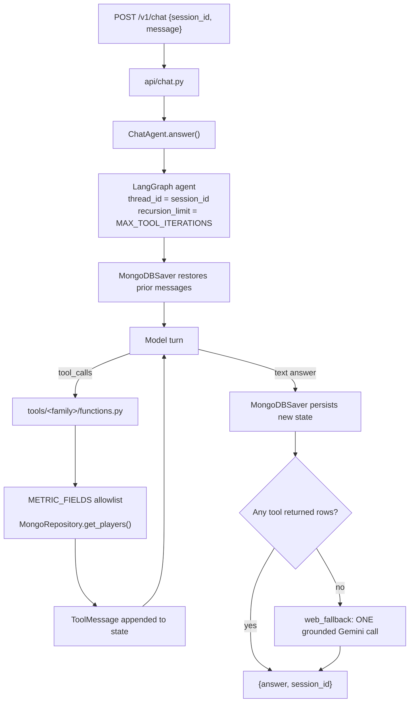

# ChatBot Agent — Design Spec

- **Date:** 2026-09-02
- **Status:** Approved design, pending implementation plan
- **Branch:** `dev/chatbot-agent`
- **Author:** Yonatan Hen (with Claude Code)
- **Replaces:** the cancelled RAG Chat feature (`dev/rag-chat`, never merged)

## 1. Summary

Add a conversational agent to the Football-Analytics app. The user asks a natural-language
question; a **tool-calling agent** decides which database tools to call, chains several
calls when needed, and answers from the returned rows. Every tool reads MongoDB through the
existing `MongoRepository` and the existing `METRIC_FIELDS` allowlist — the agent never
writes a query itself. When no tool covers the question, the agent falls back **once** to a
web-grounded model call.

This replaces the RAG design from 2026-06-24. There are no embeddings, no vector index and
no Atlas dependency. Retrieval is structured queries chosen by the model, not semantic
similarity.

## 2. Goals / Non-goals

**Goals**

- Answer analytical questions from the DB: rankings, filters, single-player values,
  comparisons ("top 5 midfielders by key passes", "who has the best s_final in La Liga").
- Chain tool calls within one turn (find the player, then read their metrics).
- Multi-turn conversation with history that survives a page reload and a new tab.
- Reach the web only when the tools cannot answer.
- Stay inside the Gemini free tier.
- Be extensible: adding a tool must not change the agent, the prompt assembly, or the API.

**Non-goals (v1)**

- Ollama or any second provider (the seam exists — see §14 — but only Gemini ships).
- Streaming responses.
- Hebrew / multilingual support.
- Showing the model's reasoning or tool trace to the user (explicitly forbidden — §11).
- Authentication or per-user isolation of chat sessions.
- Writing to the database from a tool. Every tool is read-only.

## 3. Stack (decided)

| Layer | Decision |
|---|---|
| Framework | **LangChain v1** (`langchain>=1.3`). Never a plain provider SDK. |
| Agent loop | **`langchain.agents.create_agent`** — the LangGraph-backed ReAct agent |
| LLM | **`ChatGoogleGenerativeAI`** (`langchain-google-genai>=4.4`), model from config, Gemini free tier |
| Sessions | **`langgraph-checkpoint-mongodb`** `MongoDBSaver`, `thread_id = session_id` |
| Resilience | `429` retry with backoff (`tenacity`) → fallback model → generic message |
| Tools | 8 LangChain `StructuredTool`s grouped by metric family (§6) |
| Data access | Existing `MongoRepository.get_players()` + `domain/metric_fields.METRIC_FIELDS` |
| Web fallback | One grounded Gemini call, taken only when no tool answered (§8) |
| Frontend | Plain Tailwind floating panel + full-screen view. No new npm dependency. |

### Verified dependency facts

These were checked against PyPI and the project venv, not assumed. They matter because the
previous RAG spec ruled some of them out on outdated grounds.

1. **`langchain-google-genai` no longer pulls the legacy SDK.** v4.4.0 requires
   `google-genai>=2.20.0` — the same unified SDK the RAG spec insisted on. The old ban on
   this package is obsolete.
2. **LangChain v1 already bundles LangGraph.** `langchain 1.3.18` depends on
   `langgraph>=1.2.11`, so `create_agent` costs no extra top-level dependency.
3. **LangChain v1 requires `langchain-core>=1.6.1`.** `master` has no LangChain at all, so
   this is a clean install rather than a migration.
4. **`langgraph-checkpoint-mongodb` 0.4.0 requires `pymongo>=4.12,<4.17`.** The project
   pins `pymongo==4.10.1`. **This bump is mandatory and is the one breaking change in the
   feature** — it affects every existing repository test. It also pulls
   `langchain-mongodb>=0.8.0`.
5. **The built-in fake chat models cannot test this agent.**
   `BaseChatModel.bind_tools` is an unimplemented stub, so
   `FakeMessagesListChatModel.bind_tools(...)` raises `NotImplementedError`, and
   `create_agent` calls `bind_tools`. Tests supply their own `FakeToolCallingModel` (§15).

### Why a tool-calling agent instead of RAG

The questions this app gets are analytical, not semantic: "top scorers", "best defender by
clean sheets", "compare these two". Vector similarity is the wrong retrieval method for
those — the RAG spec itself listed ranking questions as a non-goal. Structured tools over
the existing repository answer them exactly and cheaply, with no index to rebuild after
every fetch.

## 4. Architecture



Text form of the same flow:

```
user question
  → POST /v1/chat {session_id, message}
  → create_agent graph, config {thread_id: session_id, recursion_limit: MAX_ITERS}
        MongoDBSaver restores the prior messages for this thread
        ├─ model turn → tool_calls? → LangGraph runs tools/<family>/functions.py
        │                              → MongoRepository via METRIC_FIELDS allowlist
        │                              → ToolMessage back into state → model turn again
        └─ text answer → graph ends, MongoDBSaver persists the new state
  → no tool returned rows? → ONE web-grounded Gemini call (fallback only)
  → return {answer, session_id}     (no tool trace, no reasoning)
```

## 5. Backend components

The agent lives in its own `agent/` package, as required by the source note. Existing
layers (`api/`, `domain/`, `infrastructure/`, `modes/`) are untouched apart from router
registration and one dependency provider.

```
backend/app/
  agent/
    __init__.py
    agent.py          # build_agent(repo, mongo_client) + ChatAgent.answer() — main logic
    constants.py      # MAX_TOOL_ITERATIONS, MAX_ROWS, GENERIC_ERROR, HISTORY_TRIM
    system_prompt.py  # SYSTEM_PROMPT assembled from each tool package's prompts.py
    llm.py            # build_chat_model() -> ChatGoogleGenerativeAI + retry + fallback
    web_fallback.py   # the single grounded call
    tools/
      __init__.py     # build_tools(repo) -> list[BaseTool]  (the registry)
      base.py         # shared pydantic args schema + executor over METRIC_FIELDS
      attacking/        prompts.py  functions.py
      shots/            prompts.py  functions.py
      defending/        prompts.py  functions.py
      goalkeeping/      prompts.py  functions.py
      discipline/       prompts.py  functions.py
      playing_time/     prompts.py  functions.py
      composite_scores/ prompts.py  functions.py
      identity/         prompts.py  functions.py
  api/
    chat.py                  # POST /v1/chat ; GET|DELETE /v1/chat/sessions/{session_id}
    modals/chat_modals.py    # request/response pydantic models
  dependencies.py            # + get_agent()
```

There is **no** `LLMProvider` protocol and **no** `chat_session_repository`. LangChain's
`BaseChatModel` is already the provider seam, and `MongoDBSaver` is already the session
store. Adding either would be duplicate machinery.

Each tool package exposes exactly two things:

- `prompts.py` — `DESCRIPTION` (the tool description the model sees) and `GUIDANCE` (the
  paragraph appended to the system prompt explaining when to reach for this tool).
- `functions.py` — `build(repo) -> list[BaseTool]`, taking the repository by injection so
  the tools are unit-testable against `mongomock` with no global state.

## 6. Tool families

The source note asked for one tool per metric. `Stats` has 35 numeric fields and there are
4 composite scores — 39 tool schemas would be sent on every turn, which hurts tool
selection and wastes free-tier tokens. Instead there are **8 tools grouped by metric
family**, each taking a `metric` argument restricted by a `Literal` to its own family. All
39 allowlisted metrics stay reachable, and adding a field to `Stats` needs no new tool.

| Tool | Metrics |
|---|---|
| `attacking` | `goals`, `assists`, `xg`, `xa`, `key_passes`, `big_chances_created`, `pk_won`, `pk_scored` |
| `shots` | `total_shots`, `shots_on_target`, `shots_off_target`, `scoring_frequency`, `headed_goals`, `left_foot_goals`, `right_foot_goals`, `pk_taken`, `penalty_miss` |
| `defending` | `clean_sheets`, `goals_conceded`, `penalty_conceded` |
| `goalkeeping` | `saves`, `saves_outside_box`, `goals_prevented`, `high_claims`, `pk_saved`, `penalty_faced` |
| `discipline` | `yellow_cards`, `red_cards`, `yellow_red_cards`, `direct_red_cards`, `fouls_committed` |
| `playing_time` | `minutes`, `appearances`, `matches_started`, `rating` |
| `composite_scores` | `s_final`, `offensive`, `defensive`, `tactical` (plus `sleeper_flag` / `sleeper_ratio` in the output) |
| `identity` | non-metric: find a player by name, full profile, compare two players, competition and season coverage |

The seven metric families cover 8 + 9 + 3 + 6 + 5 + 4 + 4 = **39 metrics**, exactly the
size of `METRIC_FIELDS`. Each metric appears in exactly one family.

> **Note on `defending`.** `Stats` has no outfield defending metrics — no tackles,
> interceptions or clearances are collected from Sofascore today. The family is therefore
> limited to the three fields above, and its `GUIDANCE` says so plainly, so the model
> answers "that data is not collected" instead of substituting a different metric. If
> defensive fields are added later (see the defender-representation design), they join this
> family and nothing else changes.

### Shared tool signature

The seven metric tools share one pydantic args schema, defined once in `tools/base.py`:

| Argument | Type | Meaning |
|---|---|---|
| `operation` | `"rank" \| "filter" \| "player_value"` | rank by the metric, filter on a range, or read one player's value |
| `metric` | `Literal[...]` per family | which metric to act on |
| `position` | `"GK" \| "DF" \| "MF" \| "FW" \| None` | optional filter |
| `team`, `nationality` | `str \| None` | optional filters |
| `competition` | `str \| None` | maps to `stats_view`, re-aggregating for one competition |
| `player_name` | `str \| None` | required for `player_value` |
| `min_value`, `max_value` | `float \| None` | for `filter` |
| `limit` | `int` (default 10, capped at `MAX_ROWS`) | result size |

Every call resolves through `METRIC_FIELDS` and then `MongoRepository.get_players()`. The
allowlist is the injection guard: a `metric` outside it never reaches Mongo. Because the
schema is shared, tools compose naturally — the model calls `identity` to resolve a name,
then `attacking` and `playing_time` for that player, and answers from all three.

Tools return compact JSON rows (name, team, position, the requested metric, and `s_final`
for context), truncated to `MAX_ROWS`, so a wide result never blows the context window.

## 7. System prompt

`system_prompt.py` assembles `SYSTEM_PROMPT` at import time from the tool registry, so it
can never drift from the tools that are actually bound. It contains:

1. Role: a football analytics assistant for this specific database.
2. Scope: men's football only; the seasons and competitions actually loaded.
3. One paragraph per tool, taken verbatim from that package's `prompts.GUIDANCE`.
4. Chaining guidance: resolve identity first, then read metrics; call several tools before
   answering when the question needs it.
5. Answer policy: answer from tool results; never invent numbers; if no tool covers the
   question, say so plainly in the final message rather than guessing.
6. The output ban: never reveal reasoning, tool names, arguments, or raw rows. Give the
   answer only.

## 8. Web-search fallback

Fallback only, never a bound tool. Two reasons for keeping it outside the tool list: it
stops the model from reaching for the web when a DB tool would do, and it avoids depending
on whether a given Gemini model can mix `google_search` with function declarations in one
request.

The flow: after the graph returns, inspect the final state. If no `ToolMessage` produced
usable rows — the model called nothing, or every call came back empty — make **one**
grounded Gemini call with the original question and return that answer instead. Otherwise
return the graph's answer untouched.

*Build-time verification:* whether `ChatGoogleGenerativeAI` exposes Google Search grounding
directly, or whether this call goes through the `google-genai` client (already installed as
a transitive dependency of `langchain-google-genai`). Either satisfies the design.

## 9. Sessions

`MongoDBSaver` persists the graph state per `thread_id`. The frontend mints a UUID
`session_id` on first use and keeps it in `localStorage`, so the full-screen tab and a
reloaded page both resume the same conversation. The backend passes
`config={"configurable": {"thread_id": session_id}}` and does nothing else — history is
restored and saved by LangGraph.

The stored documents are **LangGraph checkpoint blobs, not readable turns**. This is the
accepted cost of the near-zero session code. Consequently `GET /v1/chat/sessions/{id}`
reads history back through `agent.aget_state(config)` and maps the messages to
`{role, content}` for the UI — it never queries the checkpoint collection directly.

Old threads are not expired in v1. A TTL index on the checkpoint collection is a
possible follow-up.

## 10. API endpoints

| Method | Path | Purpose |
|---|---|---|
| `POST` | `/v1/chat` | Body `{ session_id, message }` → `{ answer, session_id, degraded }` |
| `GET` | `/v1/chat/sessions/{session_id}` | Replay history as `{ turns: [{role, content}] }` for a reopened tab |
| `DELETE` | `/v1/chat/sessions/{session_id}` | Clear the thread (new chat) |

The `POST` response carries the answer only — no tool trace, no reasoning, no intermediate
messages. `degraded` is a boolean flag telling the UI the answer came from the error path.

## 11. Error handling

One `try/except` wraps the agent call in `api/chat.py`:

- `logger.exception(...)` server-side, with the full traceback, so failures are debuggable
  from the backend logs.
- The client gets the `GENERIC_ERROR` constant and `degraded: true`, with HTTP 200 — not a
  500 and not a stack trace. No model names, Mongo errors, quota messages or file paths
  cross the boundary.
- The same applies inside tools: a tool that fails returns a short "could not read that
  data" string to the model rather than raising, so one bad call does not kill the turn.

## 12. Frontend

- **Floating panel.** A collapsible bubble fixed bottom-right, rendered once in `App.tsx`
  so it floats above every tab. Collapsed it is a small circular button; expanded it is a
  panel with a 1–2 sentence instruction line at the top ("Ask about any player or metric in
  the database. I can rank, filter and compare.").
- **Full screen.** A link inside the panel — not in the navbar — opens `?chat=1` in a new
  tab. `App.tsx` reads that query param and renders `ChatFullScreen` instead of the tab
  layout. This avoids adding `react-router` to a project that has none.
- **Session continuity.** `session_id` comes from `localStorage`, so the new tab loads the
  same conversation through `GET /v1/chat/sessions/{id}`.
- **Styling.** Plain Tailwind, matching the existing dark theme. No chat UI library — the
  previous design flagged a CSS clash between `@chatscope` and Tailwind, and the component
  is small enough not to need one.

```
frontend/src/
  api/chat.ts                  # sendChat, getSession, clearSession
  components/ChatWidget.tsx    # floating collapsible panel
  pages/ChatFullScreen.tsx     # full-screen view
  App.tsx                      # renders one or the other based on ?chat=1
```

## 13. Config

Added to `Settings` in `backend/app/config.py`, read from `secrets.env` / `.env`:

| Setting | Default |
|---|---|
| `gemini_api_key` | from env `GEMINI_API_KEY` |
| `gemini_model` | a current free-tier Gemini flash model (confirmed at build) |
| `gemini_fallback_model` | a second free-tier flash model |
| `agent_max_tool_iterations` | `8` |
| `agent_max_rows` | `25` |
| `checkpoint_collection` | `chat_checkpoints` |

`secrets.env` gains `GEMINI_API_KEY`. `OLLAMA_BASE_URL` / `OLLAMA_MODEL` are documented as
a future addition and are **not** read in v1.

## 14. Extensibility

- **A new tool** = one folder with `prompts.py` + `functions.py`, plus one line in
  `build_tools()`. The system prompt and the model's tool declarations are both generated
  from that registry, so nothing else changes. This is what the source note's
  "scalable manner" requirement means in practice.
- **A new metric** = add the field to `Stats`; it enters `METRIC_FIELDS` automatically
  (that dict is built from `dataclasses.fields(Stats)`), and joins a family's `Literal`.
- **A new provider** = build a different `BaseChatModel` in `llm.py`. For the Ollama
  fallback the source note asked about, that is `langchain-ollama`'s `ChatOllama` with a
  tool-calling model. `create_agent`, the tools and the API are unaffected.

## 15. Testing strategy

- **Tools** (`pytest` + `mongomock`): each family tool against a seeded repository —
  correct metric resolved, filters applied, row cap respected, unknown metric rejected.
- **The agent** (`backend/tests/agent/conftest.py`): a `FakeToolCallingModel(BaseChatModel)`
  that implements `_generate` to replay scripted `AIMessage`s and returns `self` from
  `bind_tools`. The built-in LangChain fakes cannot be used — `bind_tools` raises
  `NotImplementedError` on them (verified). Tests use `InMemorySaver`, not `MongoDBSaver`.
- **Covered agent behaviours:** a scripted tool call runs the right function; the
  iteration cap stops a loop; the web fallback fires only when no tool returned rows; the
  response contains the answer only.
- **API** (`TestClient` + `dependency_overrides`): success shape, and that a raising agent
  produces the generic message with HTTP 200 rather than a 500.
- No live Gemini call in CI. No frontend tests, consistent with the project.
- All backend tooling runs via `.venv\Scripts\python` per project convention.

## 16. Build-time verifications

1. Confirm the configured `gemini_model` and `gemini_fallback_model` exist and are
   available on the free AI Studio tier; adjust the config defaults if not.
2. Confirm the tool-calling response shape from `ChatGoogleGenerativeAI` matches what
   `create_agent` expects for the installed versions.
3. Confirm how Google Search grounding is invoked for the fallback call (§8).
4. Confirm `mongomock==4.2.0.post1` still works after the `pymongo` bump, and that the full
   existing test suite passes on the new pin **before** any agent code is written.
5. Confirm `MongoDBSaver` creates its collections on a plain `mongo:7` container — it needs
   no Atlas features, unlike the abandoned vector design.

All model names are config-driven, so a failed check is a config change, not a rewrite.

## 17. Risks & mitigations

| Risk | Mitigation |
|---|---|
| `pymongo` bump breaks existing repository tests | Bump and run the full suite as the first task, before any new code — a clean baseline or an early stop |
| Gemini free-tier quota exhaustion | `429` retry with backoff → fallback model → generic message; web grounding used only as a last resort |
| Model picks the wrong tool | Families are small and disjoint; each `GUIDANCE` paragraph says when *not* to use the tool; `defending` states its own data gap |
| Tool result floods the context | `MAX_ROWS` cap and compact JSON rows |
| Runaway tool loop | `recursion_limit = agent_max_tool_iterations` |
| LangChain v1 API churn | Pinned minimums in `requirements.txt`; the agent surface used is small (`create_agent`, `BaseChatModel`, `StructuredTool`) |
| Checkpoint documents are unreadable | Accepted and documented; history is read back through `aget_state`, never by querying the collection |
| Reasoning leaking to the user | The API returns only the final message content; the response model has no field that could carry a trace |

## 18. Out of scope / future

- Ollama or any second provider (the seam is ready).
- Streaming responses; Hebrew/multilingual support.
- Tools that write to the database, or that trigger a Sofascore fetch.
- Per-user auth and session isolation; TTL expiry of old threads.
- Tools over match-level data, news, or Sport-5 pricing.
- Defensive metrics for the `defending` family, pending the defender-representation work.

## 19. Traceability to the source note

The hand-written note `docs/superpowers/specs/chatbot-agent.md` had 14 numbered
requirements. It is deleted by this change; every requirement maps to a section here.

| # | Requirement | Where |
|---|---|---|
| 1 | Tool-calling agent over MongoDB, chaining allowed | §4, §6 |
| 2 | Gemini primary, Ollama fallback, keys in gitignored env | §3, §13, §14, §18 |
| 3 | A tool per metric + a suggested prompt/flow | §6 (grouped into 8 families — see the rationale there), §7 |
| 4 | Web search as a fallback only | §8 |
| 5 | Floating modal, collapsible, on all pages, with instructions | §12 |
| 6 | Full-screen in a new tab, no navbar tab | §12 |
| 7 | System prompt describes agent + tools; history-aware chat | §7, §9 |
| 8 | Reasoning stays in the backend, never shown | §10, §11, §17 |
| 9 | Scalable — future tools drop in | §14 |
| 10 | Show the flow visually before implementing | §4, and Task 0 of the implementation plan |
| 11 | Generic errors to the user, full detail in server logs | §11 |
| 12 | Not RAG — delete the RAG, this replaces it | §1, §3 (`dev/rag-chat` deleted, tip was `16ccfd4`) |
| 13 | Pull up-to-date `master` before implementing | `dev/chatbot-agent` branched from `master` at `b19cd9a` |
| 14 | An `agent/` folder split into `agent.py`, `constants.py`, `system_prompt.py`, `tools/<tool>/{prompts,functions}.py` | §5 |

## 20. Process notes

- Branch `dev/chatbot-agent`, created from `master` at `b19cd9a`.
- DB snapshot before implementation (project rule).
- The RAG branch `dev/rag-chat` was deleted local and remote; its tip was `16ccfd4`,
  recoverable from the local reflog if ever needed.
- `pre-pr-lint` before opening the PR; PR to `master` only after CI passes; delete the
  branch after merge.
